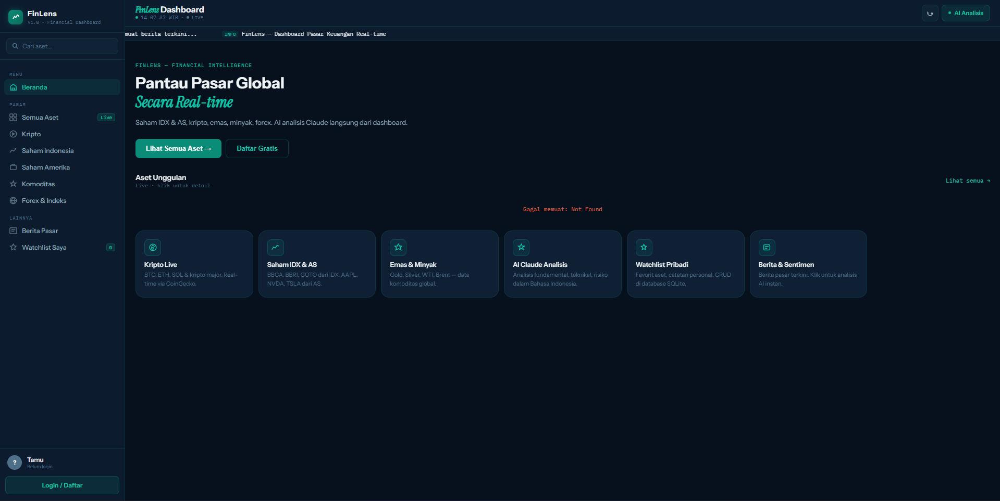

# FinLens v1.0 — Financial Market Dashboard



Dashboard pasar keuangan real-time: saham IDX & AS, kripto, emas, minyak, forex, indeks global. Dengan AI analisis berbasis Claude, watchlist CRUD, login/register, dan berita pasar.

---

## Quick Start (3 langkah)

```bash
# 1. Masuk ke folder
cd finlens

# 2. Copy env & isi API key
cp .env.example .env
# Edit .env → tambahkan ANTHROPIC_API_KEY=sk-ant-xxxxxxx

# 3. Setup & jalankan
npm run setup   # install deps + seed DB
npm run dev     # buka http://localhost:3000
```

**Demo account (langsung pakai):** `demo@finlens.id` / `demo1234`

---

## Struktur Project (25 file)

```
finlens/
├── server/
│   ├── index.js                  ← Express entry point + SSE
│   ├── db/
│   │   ├── schema.js             ← 8 tabel SQLite (users, assets, watchlist, dll)
│   │   └── queries.js            ← Semua prepared statements
│   ├── routes/
│   │   ├── auth.js               ← Register, login, profile, change password
│   │   ├── market.js             ← Assets, prices, history, news
│   │   ├── ai.js                 ← Proxy Claude API + AI log
│   │   └── watchlist.js          ← CRUD watchlist per user
│   ├── middleware/
│   │   ├── index.js              ← Helmet, CORS, Morgan, rate limiter, errors
│   │   └── auth.js               ← JWT sign/verify, requireAuth, optionalAuth
│   └── jobs/
│       └── priceFetcher.js       ← CoinGecko + Yahoo Finance + cron + SSE broadcast
│
├── public/
│   ├── index.html                ← SPA - semua halaman dalam 1 HTML
│   ├── css/main.css              ← Mobile-first design system lengkap
│   └── js/
│       ├── app.js                ← Orchestrator (navigation, init, SSE)
│       └── modules/
│           ├── api.js            ← HTTP client (semua fetch ke backend)
│           ├── auth.js           ← Login/register modal & state
│           ├── market.js         ← Asset list, detail, news render
│           ├── watchlist.js      ← CRUD watchlist UI
│           ├── ai.js             ← AI chat panel
│           ├── sse.js            ← Server-Sent Events client
│           └── ui.js             ← Toast, formatters, chart helpers
│
└── scripts/
    └── seed.js                   ← 30 aset master + demo user + berita demo
```

---

## Config .env

```env
PORT=3000
NODE_ENV=development
JWT_SECRET=ganti_dengan_string_random_panjang_di_production
ANTHROPIC_API_KEY=sk-ant-xxxxxxxxxxxxxxxx   # Wajib untuk AI chat
DB_PATH=./database/finlens.db
```

> Tanpa `ANTHROPIC_API_KEY`: semua fitur berjalan, AI chat tampilkan pesan konfigurasi.

---

## API Endpoints

### Auth
```
POST /api/auth/register    { email, username, password }
POST /api/auth/login       { email, password }
GET  /api/auth/verify      → cek validitas token
GET  /api/auth/profile     → profil + riwayat AI
PUT  /api/auth/password    { old_password, new_password }
```

### Market Data (Free APIs)
```
GET /api/market/assets?type=crypto     → list aset + harga cache
GET /api/market/assets/:symbol         → detail + history + watchlist status
GET /api/market/assets/:symbol/history?days=90
GET /api/market/prices?symbols=BTC,ETH,BBCA.JK
GET /api/market/news?category=crypto&limit=20
```

### Watchlist (CRUD — butuh login)
```
GET    /api/watchlist           → list semua favorit
POST   /api/watchlist           { asset_id, notes }
PUT    /api/watchlist/:id       { notes }
DELETE /api/watchlist/:id
PUT    /api/watchlist/:id/order { order }
```

### AI (butuh login)
```
POST /api/ai/chat     { question, asset_symbol?, context? }
GET  /api/ai/history  → riwayat chat user
```

### System
```
GET /api/health   → health check
GET /api/events   → SSE live feed
```

---

## Keputusan Arsitektur

| Aspek | Pilihan | Alasan |
|-------|---------|--------|
| **Database** | SQLite (better-sqlite3) | Zero-config, sinkron, cepat untuk read-heavy dashboard |
| **Auth** | JWT (jsonwebtoken) | Stateless, mudah di-scale, expire otomatis |
| **Password** | bcryptjs (cost 12) | Industry standard, aman untuk production |
| **Live Update** | Server-Sent Events | Lebih simpel dari WebSocket, cukup untuk 1-way push |
| **Price Source** | CoinGecko + Yahoo Finance | Gratis, no API key, reliable |
| **AI** | Server-side proxy | API key tidak terekspos ke client |
| **Frontend** | Vanilla ES Modules | Zero build step, langsung jalan di browser modern |
| **Mobile** | CSS-only responsive | Hamburger menu, fluid grid, touch-friendly |

---

## Free APIs yang Digunakan

| API | Data | Key? |
|-----|------|------|
| [CoinGecko](https://coingecko.com/api) | Harga crypto, market cap, ATH/ATL | ❌ Tidak perlu |
| [Yahoo Finance](https://query1.finance.yahoo.com) | Saham, komoditas, forex, indeks | ❌ Tidak perlu |
| [Anthropic Claude](https://anthropic.com) | AI analisis | ✅ Diperlukan |

## Production Deployment

```bash
# Set environment
NODE_ENV=production
JWT_SECRET=<random 64 char string>
ALLOWED_ORIGIN=https://yourdomain.com

# Jalankan dengan PM2
npm install -g pm2
pm2 start server/index.js --name finlens
pm2 save

# Nginx reverse proxy ke port 3000
```

---

## Development Scripts

```bash
npm run dev    # Start dengan auto-reload (node --watch)
npm run start  # Start production
npm run seed   # Reset & seed ulang database
```

---

## Dependencies

```
express         — HTTP server & routing
better-sqlite3  — SQLite driver (sinkron, cepat)
jsonwebtoken    — JWT auth tokens
bcryptjs        — Password hashing
node-cron       — Scheduled price updates (5 menit)
helmet          — Security HTTP headers
cors            — Cross-Origin Resource Sharing
morgan          — HTTP request logging
express-rate-limit — Rate limiting per IP
dotenv          — Environment variables
node-fetch      — Fetch API untuk Node.js
```
